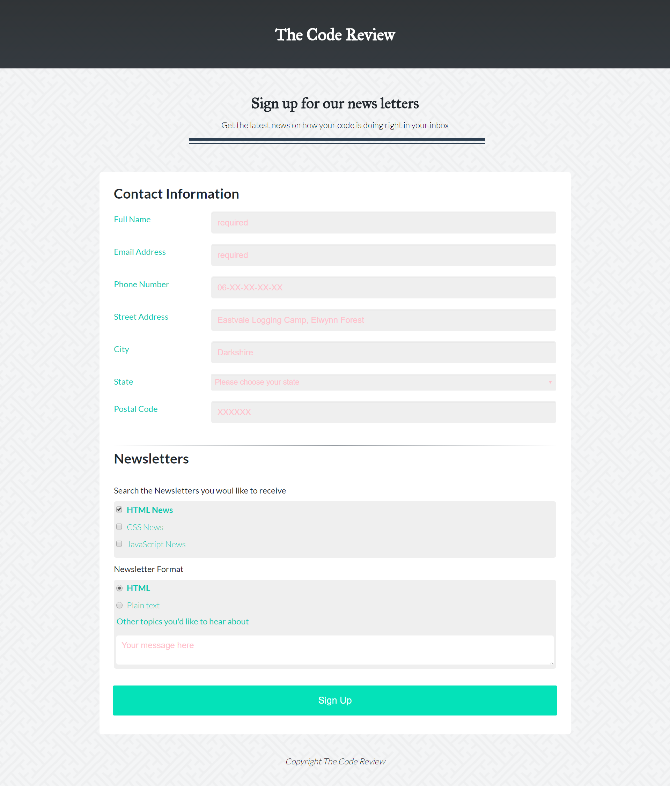

# Online Registration Form
## techdegree-project-3

**Project not Submit**

**In Progress**

In this project you'll build a responsive, mobile-friendly registration form using a wide variety of HTML form input types and attributes. Using the supplied mockup files, you'll build a mobile and desktop version of the form using media queries, and a "mobile-first" approach.

--------------------------------------------------------------

**NOTE: The Front End Web Development Techdegree is meant to train you in HTML, CSS and JavaScript, and let you practice and show your mastery of these fundamental building blocks of the web. Because of that, please avoid using frameworks like Bootstrap, Foundation, Skeleton, and so on for this project. Even though you may end up using frameworks like these professionally, you still need to know and be able to implement designs with your own knowledge of HTML, CSS and JavaScript.**

In addition, please avoid submitting any projects that rely on a server-side technology like PHP or Ruby on Rails.

**Project Instruction**

**For this project we will be checking the design in Google Chrome version 48 or higher. Different browsers display forms slightly differently so please make sure it looks correct in Google Chrome before submitting.**

*Build the layout using a mobile first design:*
 * Make sure the HTML file includes the viewport meta tag in the head of the document, see Configuring the Viewport to understand why and how to add this tag.
 * Look at the provided mockup (mobile-form.png) and add the same content into your index.html file.
 
 *Create the form structure:*
  * "Contact Information" section of the page, and
  * The "Newsletter" section of the page
  
 **Note: You don't need to make a functioning form -- that is, it doesn't have to do anything when the form is submitted. To do that, you'd need to add some server-side programming to actually process the user's input.**
 
 --------------------------------------------------------------
 
 **Make sure you include the following form field types:**
  * text input
  * email input
  * telephone input
  * select menu
  * checkboxes
  * radio buttons
  * textfield
  * submit button
  
  --------------------------------------------------------------
  
  **Form fields should include the following attributes:**
   * input: should include id, type and name attributes.
   * select and textarea: should include id and name attributes.
   
   **Note:**
    * Checkboxes should have unique name attributes
    * Radio Buttons should have identical name attributes
    
    
 --------------------------------------------------------------
  
  **Once you have everything in place for the mobile layout, use a media query to add a breakpoint to adjust the layout for wider tablet and desktop screens.**
   * Match the design as it should look on a tablet or desktop that is 768px wide using the desktop-form.png mockup.
   * Use a mobile-first approach by writing your media queries using the min-width property in your CSS.
   
   
 --------------------------------------------------------------
    
 **Once all your breakpoints are in place, double check your layout matches both the mockups.**
  * Check that the label text position matches both mockups:
   * Mobile: Text should be above the form field.
   * Desktop: Text should be to the left side of the form field. 

 --------------------------------------------------------------
    
 **Use a Google Font for the text. The design uses the "Merriweather" font but, you can use any Google Font that you'd like.**
 
 --------------------------------------------------------------
 
**Add :focus states to the form for when a user clicks or tabs into a text field.**

--------------------------------------------------------------

**Make sure to check your code is valid by running it through an HTML and CSS validator.**
 * Links to the validators can be found in the Project Resources. This will help you spot any errors that might be in your code.
 * There are a few exceptions that you don’t need to fix:
 * Don’t worry about any warnings, we just need you to check any errors that might be there.
 * If CSS validator flags use of calc, vendor prefixes or pseudo-elements/pseudo-classes these errors should be ignored.
 * If HTML validator flags use of pipe (‘|’) in Google font links/URLs this error can also be ignored.
 
 
 --------------------------------------------------------------
 
 **Before you submit your project for review, make sure you can check off all of the items on the Student Project Submission Checklist. The checklist is designed to help you make sure you’ve met the grading requirements and that your project is complete and ready to be submitted!**
 
 
 --------------------------------------------------------------

**Extra Credit**

To get an "exceeds" rating, you can expand on the project in the following ways:

**Additional placeholder text for other text fields.**

--------------------------------------------------------------

**Use the required attribute to add HTML5 validation to make sure that required fields are filled out and input is formatted correctly.**

--------------------------------------------------------------

**Add at least the following additional styling enhancements to the form, feel free to extra styling but leave the basic layout the same as the mockup.:**
 * Change the background color for at least ONE of the main sections of the site.
 * Uses CSS transitions for focus states.
 
--------------------------------------------------------------

**Use CSS transition effects for highlighting the look of the form fields.**
 * For example, make a background color fade into view when the field the user clicks into a text field, and fade out when the user clicks or tabs out of the field.

--------------------------------------------------------------

 

    
  
      
      
